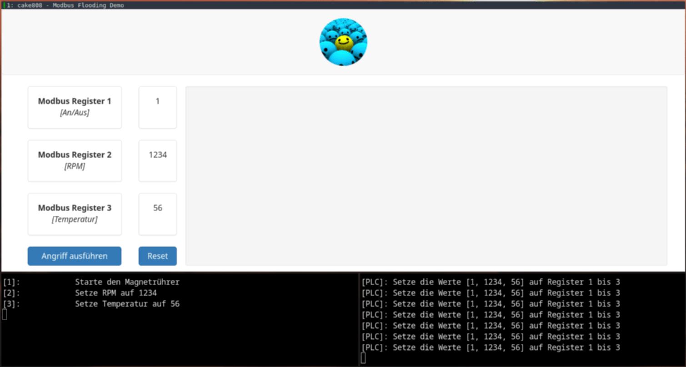

# Modbus Flooding Demo
This project was the practical part of my bachelor's thesis which discussed the Cybersecurity of Industrial Control Systems.
It is used to demonstrate a vulnerability of Modbus TCP in a simple way for non-technical persons on trade-fairs/conferences.

The project consists of 3 main components which are separated in their respective folders. 

### Modbus 
Inside this folder you find the Modbus TCP server binary and the necessary scripts to attack it.

The attack consists of scanning the subnet with `nmap` to find the Modbus TCP server.
When the server is found, the script creates a new Modbus TCP client to connect to it.
The new client floods the Modbus TCP server with its values in a way faster interval than the PLC can set its own values.

This is only possible since Modbus TCP doesn't implement security features as authentification or encryption.

### Web Application
The web application was developed in Python with the framework [Flask](https://github.com/pallets/flask).

### Progammable Logic Controller (PLC)
I used a real PLC (*Siemens Simatic S7-1200*) in the thesis, but for demonstrational purposes I wrote a script to simulate the functionality of the implemented PLC.
The simulator script creates a Modbus TCP client and sets values every 2 seconds, since the real PLC worked at a frequency of 0.5Hz which equals to 2 seconds.

## Demonstration Video

The web application is seen on the upper side of the Video.
On the bottom left side is the terminal for the Modbus TCP server and on the bottom right side, the PLC simulator terminal is seen.

The error ` bad packet error TCP Frame error: packet less than 9 bytes` shows up since the Modbus TCP server doesn't expect the `nmap` TCP packets and thus it doesn't know how to handle them.

## Usage
1. Run `Modbus/modbus-server` (root privileges are required). This will launch the Modbus server on Port 502, which is the default Modbus TCP port.
2. Run `Webanwendung/app.py`. This is the Flask web application. It runs on Port 5000.
3. Run `PLC/plc-simulator.py`. This is a Python script to simulate the functionality of the PLC.
4. Push the `Angriff ausführen` button on the web application.
